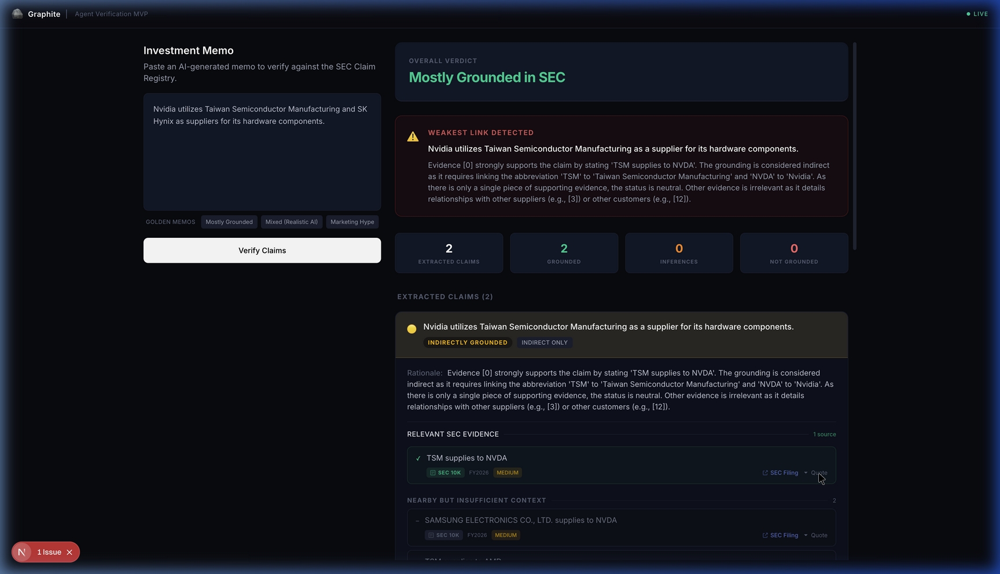

<div align="center">
  <h1>⛏️ Graphite</h1>
  <p><strong>Open-source claim verification engine for agent-generated assertions in high-stakes domains.</strong></p>
  <p>As AI agents make it cheap to generate claims, Graphite makes it possible to review them — against evidence, with provenance, before they are trusted.</p>
  <p>
    <a href="LICENSE"></a>
    <a href="https://python.org"></a>
  </p>
</div>

> ⚠️ **v0.3.x — Experimental**. Usable and tested, but API may change before 1.0. Pin your version.

---

### How it works

```python
from graphite import Claim, ClaimStore, ClaimType, ClaimOrigin, Provenance
from graphite.enums import SourceType, ConfidenceLevel

# 1. An agent or extractor produces structured claims from documents
claim = Claim(
    subject_entities=["company:TSMC"],
    predicate="SUPPLIES_TO",
    object_entities=["company:NVDA"],
    claim_text="TSMC supplies advanced CoWoS packaging to Nvidia.",
    claim_type=ClaimType.RELATIONSHIP,
    origin=ClaimOrigin.AGENT,
    generator_id="sec-extractor-v2",
    supporting_evidence=[Provenance(
        source_id="tsmc-10k-2024",
        source_type=SourceType.SEC_10K,
        evidence_quote="The Company provides advanced packaging services including CoWoS.",
        confidence=ConfidenceLevel.HIGH,
    )],
)

# 2. Save to the claim registry — evidence accumulates, claims dedupe
store = ClaimStore(db_path="/tmp/demo.db")
store.save_claim(claim)
# Save the same claim from another source → evidence grows, claim stays one
store.save_claim(same_claim_from_nvda_10k)  # now 2 evidence sources

# 3. Retrieve grounded claims and inspect their evidence
results = store.search_claims(object_contains="NVDA")
for c in results:
    print(f"{c.claim_text}  ({len(c.supporting_evidence)} sources)")
    for ev in c.supporting_evidence:
        print(f"  [{ev.source_id}] \"{ev.evidence_quote}\"")

# 4. Find related support or potential conflicts
supporting = store.find_supporting_claims(claim)
conflicts  = store.find_potential_conflicts(claim)
```

Claims are produced by agents or extraction pipelines. Graphite stores them with provenance, accumulates evidence across runs, and makes them queryable. If a claim cannot be traced to evidence, it should not be trusted.

> See [`examples/evidence_accumulation/`](examples/evidence_accumulation/) for evidence accumulation in action, or [`examples/quickstart_verification/`](examples/quickstart_verification/) for the full flow.

---

### Quickstart

```bash
pip install graphite-engine
```

Or from source:

```bash
git clone https://github.com/graf-research/graphite.git
cd graphite
pip install -e .
python examples/quickstart_verification/run.py
```

No external services. No LLM. No API keys. Start local, stay local.

---

## Why Graphite?

As AI agents generate more claims — research memos, compliance reports, risk assessments — verification becomes the bottleneck. Graphite is built for domains where being wrong is expensive: financial research, regulatory compliance, infrastructure risk.

**Graphite has two loops:**

1. **Build** a reusable claim registry from authoritative documents — each claim carries its source, quote, and confidence
2. **Check** new agent-generated claims against that registry — find supporting evidence, detect potential conflicts, flag unsupported assertions

> Like building a grounded corpus from authoritative filings, then verifying each claim in an agent's output against that corpus — with full provenance at every step.

| What you need | Typical agent stack | Graphite |
|---------------|-------------------|----------|
| **Store what the agent said** | Raw text or traces | Structured `Claim` objects with provenance |
| **See why it was generated** | Prompt/tool traces | Claim-level evidence: source, quote, confidence |
| **Re-check the same claim later** | Re-run the workflow | Reuse a persistent claim registry — evidence accumulates |
| **Detect contradictions across outputs** | Usually manual | `find_supporting_claims()` and `find_potential_conflicts()` |

### Core primitives

| Primitive | What it does |
|-----------|-------------|
| `Claim` | The atomic unit of trust — structured assertion with agent provenance |
| `ClaimStore` | Evidence-accumulating registry: claims dedupe, evidence merges |
| `Provenance` | First-class evidence source: document, quote, confidence |
| `ConfidenceScorer` | Explainable confidence scoring with named factors |
| `BaseFetcher` / `BaseExtractor` | Plugin interface for domain-specific extraction |

### What belongs where

| Graphite (engine) | Your application |
|---|---|
| Claim schemas & provenance | Domain-specific extractors |
| Claim registry & evidence accumulation | UI, workflow, review policies |
| Verification primitives & confidence scoring | Alerts, approval routing |
| Support/conflict retrieval | Domain-specific integrations |

---

## Built on Graphite

**EdgarOS** is a memo QA workflow for investment research teams: extract claims from AI-generated memos, verify them against SEC filings, and surface unsupported leaps before publication.

<p align="center">
  
</p>

*Paste an AI-generated memo → EdgarOS extracts claims → checks each against the SEC claim registry → returns verdict with provenance.*

---

## Optional extras

**Core** (always included): `networkx` + `pydantic`

```bash
pip install -e ".[llm]"     # Gemini structured extraction
pip install -e ".[neo4j]"   # Neo4j graph storage
pip install -e ".[all]"     # Everything
```

---

## License

Apache-2.0 — see [LICENSE](LICENSE).
